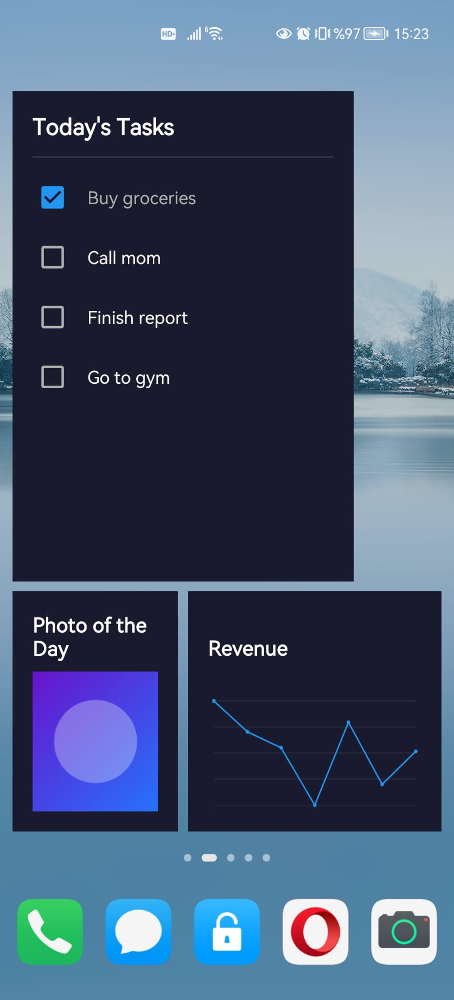
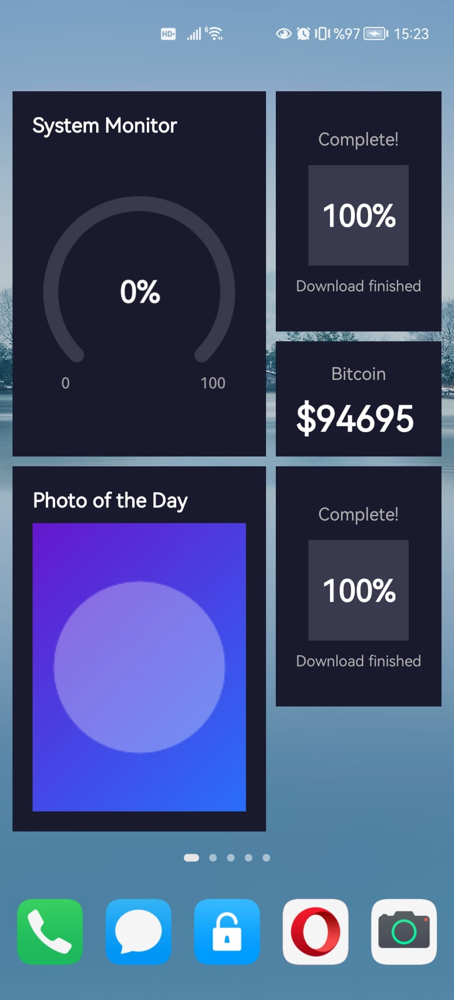
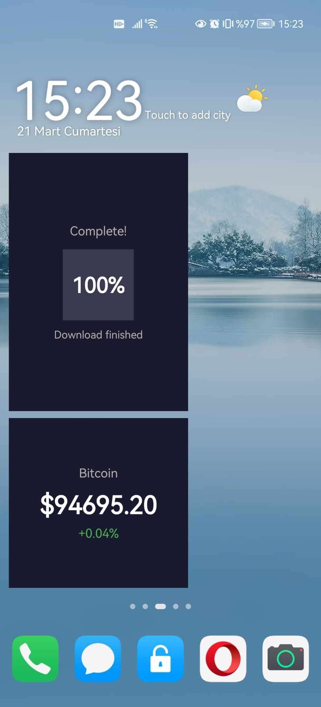

# glance_widget

[](https://pub.dev/packages/glance_widget)
[](https://opensource.org/licenses/MIT)

Create instant-updating home screen widgets for **Android** and **iOS**. Built with Jetpack Glance (Android) and WidgetKit (iOS).

<p align="center">
  
  
  
</p>

## Why glance_widget?

Unlike other packages (e.g., `home_widget`) that only provide a data bridge and
leave you to write every widget's UI in native Swift/Kotlin, **glance_widget
ships the widgets themselves**.

On Android there is genuinely nothing native to write: declare the receivers in
your manifest and you are done. On iOS, WidgetKit requires every app to own its
widget extension target, so you create that target in Xcode once and copy in the
ready-made Swift views this package provides — you write the glue, not the
widgets.

| | glance_widget | home_widget |
|---|---|---|
| **Widget UI** | 7 ready-to-use templates | Write native code yourself |
| **Type Safety** | `sealed class` + generic controllers — compile-time errors | String keys — runtime errors |
| **Real-time Updates** | `DebouncedWidgetController` — 100ms coalescing, auto-flush on app background | Not available — build it yourself |
| **Background Updates** | Built-in `GlanceBackground` (WorkManager + Timeline) | Requires external `flutter_workmanager` |
| **iOS Push** | Built-in iOS 26+ APNs support | Not available |
| **Error Reporting** | Every call applies or throws with the reason | Silent `Future<bool>` you can forget to check |
| **Platform Safety** | Silent no-op on Web/desktop, queryable via `GlanceWidget.isSupported` | Crashes on unsupported platforms |
| **Native Code** | None on Android; copy-in extension on iOS | Required for every widget |

## Features

- **Instant Updates** - Widgets update in < 1 second on both platforms
- **Cross-Platform** - Same API for Android and iOS
- **7 Widget Templates** - Simple, Progress, List, Image, Chart, Calendar, and Gauge
- **Theme Support** - Light/Dark themes with full customization, plus opt-in
  Material You on Android 12+
- **Deep Links** - All widgets support custom deep link URIs
- **Interactive Actions** - Tap, checkbox toggle, item tap handling. Ticking a
  checkbox never launches the app on either platform, and taps survive being
  delivered to a process with no Flutter engine in it
- **Background Updates** - Android widgets update even when app is closed (WorkManager)
- **Timeline Refresh** - iOS widgets refresh periodically via WidgetKit timeline policy
- **iOS 26+ Push Updates** - Server-triggered widget updates via APNs
- **Lock Screen Widgets** - Android keyguard widgets, and iOS accessory families (circular, rectangular, inline) on the lock screen and in the Smart Stack
- **Real-time Data** - Debounced controller for high-frequency updates (crypto, stocks)
- **Widget Configuration** - Handle widget setup flow when users add widgets
- **In-App Preview** - `GlancePreview` draws the widget in the app, per platform, so you can iterate on hot reload

## Platform Comparison

| Feature | Android (Jetpack Glance) | iOS (WidgetKit) |
|---------|--------------------------|-----------------|
| Update Speed | < 1 second | < 1 second (app foreground) |
| Background Updates | WorkManager (15 min+) | Timeline-based (.after policy) |
| Server Push | N/A | iOS 26+ (APNs) |
| Lock Screen | Supported (keyguard) | Accessory families (all templates except Image) |
| Interactive Actions | `ActionCallback` (checkbox + taps) | App Intents (checkbox), URL (taps) |
| Min Version | Android 8.0 (API 26) | iOS 17.0 |
| Rounded corners | `GlanceTheme.borderRadius`, Android 12+ only | `GlanceTheme.borderRadius` |
| Wallpaper colours | `useDynamicColor`, Android 12+ only | Not available |
| Adapts to slot size | `SimpleWidget` (see #28 for the rest) | All templates |

## Material You (Android 12+)

Set `useDynamicColor: true` and the widget takes its colours from the user's
wallpaper instead of the ones on the theme:

```dart
await GlanceWidget.updateSimpleWidget(
  widgetId: 'price',
  data: const SimpleWidgetData(title: 'BTC', value: '\$64,120'),
  theme: GlanceTheme.dark().copyWith(useDynamicColor: true),
);
```

It is off by default, and it is worth leaving off unless you mean it -- you are
handing your widget's appearance to whatever the user has set as their
background.

**The theme's own colours are still required, and still used.** They are the
fallback for every device that cannot supply a palette:

| | Result |
|---|---|
| Android 12+ | Wallpaper colours (`surface`, `onSurface`, `onSurfaceVariant`, `primary`) |
| Android 8-11 | The colours on your `GlanceTheme` |
| iOS | The colours on your `GlanceTheme` |

That second row is the reason this is gated rather than passed straight through.
Glance's dynamic colour providers resolve through resources whose `values-v31`
variant points at the system palette -- and whose plain `values` variant is the
static Material baseline, `#ff6750a4`. Handing them to an Android 11 device
does not fall back to your theme; it silently repaints the widget purple. So
below Android 12 the request is ignored and your colours are used.

Light and dark follow the system automatically when dynamic colour is on, so
`isDark` stops mattering.

## Interactive checkboxes

Ticking a checkbox in `ListWidget` used to open a URL, which launched the app
to change one boolean -- on the lock screen, a full unlock and a cold start.
It now runs an App Intent inside the widget extension instead: the box changes
immediately, the app stays closed, and the widget reloads in place. Android
does the same thing with an `ActionCallback`.

Your action handler does not change. The interaction is queued -- in the App
Group on iOS, in `SharedPreferences` on Android -- and replayed into the same
`onAction` stream the next time Dart is listening, carrying the time it
actually happened rather than the time the app opened:

```dart
GlanceWidget.onAction.listen((action) {
  if (action.type == 'checkboxToggle') {
    final index = action.payload!['itemIndex'] as int;
    final checked = action.payload!['value'] as bool;
    // ... your model
  }
});
```

Two consequences worth knowing:

- **The widget's stored state is already flipped** when your handler runs. The
  box would otherwise spring back the moment the timeline reloaded, which reads
  as the tap having failed. Your next `updateListWidget` is still the source of
  truth and overwrites it.
- **The backlog is capped at 100 actions.** An app that is never reopened would
  otherwise grow the queue without limit in storage the user cannot see. Past
  100, the oldest are dropped.

Item taps -- as opposed to checkbox taps -- still open the app when the widget
has a `deepLinkUri`, because opening the app is what a deep link is for. Without
one they are reported through the same queue.

The Android half of this matters more than it looks. A widget tap is delivered
to your app's process, and the system is entitled to start that process from
cold purely to deliver it -- with no Flutter engine in it, and therefore no
`onAction` stream to receive anything. The previous lambda-based actions ran in
exactly that process and wrote to a null listener, so an unlucky tap was simply
lost, with nothing in the logs to say so. Queueing to disk first removes the
race: the handler no longer has to be alive at the moment of the tap.

## Lock Screen and Smart Stack (iOS)

Six of the seven templates render in the iOS accessory families as well as on
the home screen. Adding one is the same call you already make -- the template
picks its own layout from the family the system asks for:

| Family | Where it appears | What the templates draw |
|--------|------------------|-------------------------|
| `.accessoryCircular` | Lock screen, Smart Stack | One value, or a progress ring |
| `.accessoryRectangular` | Lock screen, Smart Stack | Title plus two lines, a bar, or a sparkline |
| `.accessoryInline` | Beside the lock screen clock | One line of text |

**ImageWidget has no accessory layouts.** The system draws these families in a
single tint at roughly 58pt across; a photo reduced to that is a smear, and
offering the family would put an unreadable widget in the picker. It stays a
home screen template.

Two more things the lock screen changes, both deliberate:

- **`GlanceTheme` colours are ignored.** The system tints an accessory widget
  itself. The templates do not pass `accentColor` through, because doing so
  would read like it worked while changing nothing on screen.
- **The background is transparent.** An accessory widget sits on the user's
  wallpaper. The parts that need a backdrop ask for the system's own dimmed one.

`GlancePreview` renders the home screen layouts. There is no preview for the
accessory families yet -- the tint and vibrancy come from the lock screen
compositor, so a faithful in-app copy is not currently possible.

## Widget Templates

| Template | Description | Use Cases |
|----------|-------------|-----------|
| **SimpleWidget** | Title + Value + Subtitle | Crypto prices, weather, stats |
| **ProgressWidget** | Circular/Linear progress | Downloads, goals, battery |
| **ListWidget** | Scrollable item list with checkboxes | To-do, shopping, activities |
| **ImageWidget** | Photo with title and subtitle | Photo of the day, album art |
| **ChartWidget** | Line, bar, or sparkline chart | Revenue trends, analytics |
| **CalendarWidget** | Date header with event list | Daily schedule, meetings |
| **GaugeWidget** | Radial or dashboard metrics | CPU usage, performance scores |

## Installation

Add to your `pubspec.yaml`:

```yaml
dependencies:
  glance_widget: ^1.0.0
```

The Android and iOS implementations are endorsed, so they come along
automatically — you do not list them yourself.

## Requirements

| Platform | Minimum Version |
|----------|-----------------|
| Flutter | 3.32+ |
| Dart | 3.8+ |
| Android | API 26 (Android 8.0) |
| iOS | 17.0 |

Both CocoaPods and Swift Package Manager are supported on iOS.

---

## Android Setup

### 1. Configure Manifest

Add widget receivers to `android/app/src/main/AndroidManifest.xml`:

```xml
<application>
    <!-- Simple Widget -->
    <receiver
        android:name="dev.glance.widget.android.templates.SimpleWidgetReceiver"
        android:exported="true">
        <intent-filter>
            <action android:name="android.appwidget.action.APPWIDGET_UPDATE" />
        </intent-filter>
        <meta-data
            android:name="android.appwidget.provider"
            android:resource="@xml/simple_widget_info" />
    </receiver>

    <!-- Progress Widget -->
    <receiver
        android:name="dev.glance.widget.android.templates.ProgressWidgetReceiver"
        android:exported="true">
        <intent-filter>
            <action android:name="android.appwidget.action.APPWIDGET_UPDATE" />
        </intent-filter>
        <meta-data
            android:name="android.appwidget.provider"
            android:resource="@xml/progress_widget_info" />
    </receiver>

    <!-- List Widget -->
    <receiver
        android:name="dev.glance.widget.android.templates.ListWidgetReceiver"
        android:exported="true">
        <intent-filter>
            <action android:name="android.appwidget.action.APPWIDGET_UPDATE" />
        </intent-filter>
        <meta-data
            android:name="android.appwidget.provider"
            android:resource="@xml/list_widget_info" />
    </receiver>

    <!-- Image Widget -->
    <receiver
        android:name="dev.glance.widget.android.templates.ImageWidgetReceiver"
        android:exported="true">
        <intent-filter>
            <action android:name="android.appwidget.action.APPWIDGET_UPDATE" />
        </intent-filter>
        <meta-data
            android:name="android.appwidget.provider"
            android:resource="@xml/image_widget_info" />
    </receiver>

    <!-- Chart Widget -->
    <receiver
        android:name="dev.glance.widget.android.templates.ChartWidgetReceiver"
        android:exported="true">
        <intent-filter>
            <action android:name="android.appwidget.action.APPWIDGET_UPDATE" />
        </intent-filter>
        <meta-data
            android:name="android.appwidget.provider"
            android:resource="@xml/chart_widget_info" />
    </receiver>

    <!-- Calendar Widget -->
    <receiver
        android:name="dev.glance.widget.android.templates.CalendarWidgetReceiver"
        android:exported="true">
        <intent-filter>
            <action android:name="android.appwidget.action.APPWIDGET_UPDATE" />
        </intent-filter>
        <meta-data
            android:name="android.appwidget.provider"
            android:resource="@xml/calendar_widget_info" />
    </receiver>

    <!-- Gauge Widget -->
    <receiver
        android:name="dev.glance.widget.android.templates.GaugeWidgetReceiver"
        android:exported="true">
        <intent-filter>
            <action android:name="android.appwidget.action.APPWIDGET_UPDATE" />
        </intent-filter>
        <meta-data
            android:name="android.appwidget.provider"
            android:resource="@xml/gauge_widget_info" />
    </receiver>
</application>
```

### 2. Create Widget Info XML

Create `android/app/src/main/res/xml/simple_widget_info.xml` (repeat for each template):

```xml
<?xml version="1.0" encoding="utf-8"?>
<appwidget-provider xmlns:android="http://schemas.android.com/apk/res/android"
    android:minWidth="180dp"
    android:minHeight="110dp"
    android:targetCellWidth="3"
    android:targetCellHeight="2"
    android:resizeMode="horizontal|vertical"
    android:widgetCategory="home_screen|keyguard"
    android:updatePeriodMillis="0" />
```

### 3. Set SDK Versions

In `android/app/build.gradle.kts`:

```kotlin
android {
    compileSdk = flutter.compileSdkVersion
    defaultConfig {
        // Jetpack Glance app widgets require API 26.
        minSdk = 26
    }
}
```

That is the whole Android setup. You do **not** need to enable Jetpack Compose in
your app: the plugin renders with Compose, so it brings its own Compose compiler
and applies it only to itself, tracking whatever Kotlin version your app
resolved. Apps that need to pin a different one can set `glance.kotlinVersion` in
`android/gradle.properties`.

---

## iOS Setup

### 1. Create Widget Extension

In Xcode:
1. Open `ios/Runner.xcworkspace`
2. File → New → Target → Widget Extension
3. Name: `GlanceWidgets`
4. Click Finish

### 2. Configure App Groups

Both targets need the same App Group, **and both need to be told its name.**

1. Select `Runner` target → Signing & Capabilities → + App Groups
2. Add: `group.com.yourcompany.yourapp`
3. Select `GlanceWidgets` target → repeat with the same App Group ID
4. Add this to **both** targets' `Info.plist`:

```xml
<key>GlanceWidgetAppGroup</key>
<string>group.com.yourcompany.yourapp</string>
```

Step 4 is not optional and not cosmetic. The entitlement grants access to the
group; it does not tell the plugin which group to use. Without the key the
plugin falls back to the example app's group, which your app has no entitlement
for -- `UserDefaults(suiteName:)` returns nil, every update fails, and the
widget sits on its placeholder data with nothing in the console to explain it.

If the key is missing you will now see this in Console.app, which is the one
place the old version said nothing at all:

```
No App Group configured. Add a GlanceWidgetAppGroup key to the app's
Info.plist ... every widget update will do nothing.
```

### 3. Add Widget Files

Copy the ready-made views from [`glance_widget_ios/example/ios/GlanceWidgets/`](https://github.com/abdullahtas0/glance_widget/blob/master/packages/glance_widget_ios/example/ios/GlanceWidgets) into your extension target:
- `GlanceWidgets.swift`
- `SharedModels.swift` (reads `GlanceWidgetAppGroup` from the extension's Info.plist; nothing to edit)
- `SimpleWidget.swift`
- `ProgressWidget.swift`
- `ListWidget.swift`
- `ImageWidget.swift`
- `ChartWidget.swift`
- `CalendarWidget.swift`
- `GaugeWidget.swift`

### 4. Set the Deployment Target

This plugin requires iOS 17. Set it in Xcode under Runner → General →
Minimum Deployments, and in `ios/Podfile` as well if your project still uses
CocoaPods:

```ruby
platform :ios, '17.0'
```

Under Swift Package Manager the Xcode value (`IPHONEOS_DEPLOYMENT_TARGET`) is
the one that counts, and it reaches the build only through `flutter build ios`
— `--config-only` is enough. `flutter pub get` rewrites
`FlutterGeneratedPluginSwiftPackage` at Flutter's own 15.0 default every time it
runs, so going straight from `pub get` to `xcodebuild` stops with
`requires minimum platform version 17.0 for the iOS platform` however the
project is configured. Run a build first.

### 5. Configure URL Scheme

Add to `ios/Runner/Info.plist`:

```xml
<key>CFBundleURLTypes</key>
<array>
    <dict>
        <key>CFBundleURLSchemes</key>
        <array>
            <string>glancewidget</string>
        </array>
    </dict>
</array>
```

See the [iOS Widget Setup Guide](https://github.com/abdullahtas0/glance_widget/blob/master/packages/glance_widget_ios/example/ios/WIDGET_SETUP.md) for detailed instructions.

### 6. Placing More Than One Widget of the Same Template

`widgetId` identifies a widget instance, so two `SimpleWidget`s can show
different things — one `'btc'`, one `'eth'`. On Android that routing is
automatic. On iOS the person placing the widget chooses which id it shows,
because only they know which of the two home-screen widgets is meant to be
which:

> Long-press the widget → **Edit Widget** → pick an id from **Widget**.

The list offers the ids your app has actually sent data for. Until an instance
is configured it shows whichever id was updated most recently, so a freshly
placed widget is never blank.

This is why the templates use `AppIntentConfiguration` rather than
`StaticConfiguration` — the latter carries no per-instance parameter, so every
placed widget would read the same payload. If you write your own template, keep
the intent, and pass `configuration.widgetId` into `load...Widget(widgetId:)`.

---

## Usage

### Simple Widget

```dart
import 'package:glance_widget/glance_widget.dart';

await GlanceWidget.simple(
  id: 'crypto_btc',
  title: 'Bitcoin',
  value: '\$94,532.00',
  subtitle: '+2.34%',
  subtitleColor: Colors.green,
  deepLinkUri: 'myapp://crypto/btc',
);
```

### Type-Safe Controllers (v1.0)

For advanced use cases, use generic type-safe controllers:

```dart
import 'package:glance_widget/glance_widget.dart';

// Convenience controller — compile-time type safety
final controller = SimpleWidgetController(widgetId: 'crypto_btc');

await controller.update(SimpleWidgetData(
  title: 'Bitcoin',
  value: '\$94,532.00',
  subtitle: '+2.34%',
  subtitleColor: Colors.green,
));

// Listen for widget interactions
controller.onAction.listen((action) {
  print('Widget tapped: ${action.type}');
});

// Don't forget to dispose
controller.dispose();
```

Available controllers:
- `SimpleWidgetController`
- `ProgressWidgetController`
- `ListWidgetController`
- `ImageWidgetController`
- `ChartWidgetController`
- `CalendarWidgetController`
- `GaugeWidgetController`

Or use the generic form directly:
```dart
final ctrl = GlanceWidgetController<ChartWidgetData>(widgetId: 'chart1');
await ctrl.update(ChartWidgetData(
  title: 'Revenue',
  dataPoints: [12, 19, 15, 25, 22, 30, 28],
));
ctrl.dispose();
```

### Progress Widget

```dart
await GlanceWidget.progress(
  id: 'daily_goal',
  title: 'Steps Today',
  progress: 0.75,
  subtitle: '7,500 / 10,000',
  progressType: ProgressType.circular,
  progressColor: Colors.green,
);
```

### List Widget

```dart
await GlanceWidget.list(
  id: 'todo_list',
  title: 'Today\'s Tasks',
  items: [
    GlanceListItem(text: 'Buy groceries', checked: true),
    GlanceListItem(text: 'Call mom', checked: false),
  ],
  showCheckboxes: true,
);
```

### Image Widget

```dart
await GlanceWidget.image(
  id: 'photo',
  title: 'Photo of the Day',
  imageBase64: base64EncodedImage,
  subtitle: 'Beautiful sunset',
  fit: ImageFit.cover,
);
```

### Chart Widget

```dart
await GlanceWidget.chart(
  id: 'revenue',
  title: 'Revenue',
  dataPoints: [12, 19, 15, 25, 22, 30, 28],
  chartType: ChartType.line,
  color: Colors.blue,
  subtitle: 'Last 7 days',
);
```

### Calendar Widget

```dart
await GlanceWidget.calendar(
  id: 'events',
  title: 'Today\'s Events',
  date: DateTime.now(),
  events: [
    CalendarEvent(time: '09:00', title: 'Standup', color: Colors.green),
    CalendarEvent(time: '14:00', title: 'Review', color: Colors.blue),
  ],
);
```

### Gauge Widget

```dart
await GlanceWidget.gauge(
  id: 'monitor',
  title: 'System Monitor',
  metrics: [
    GaugeMetric(label: 'CPU', value: 45, maxValue: 100, color: Colors.green, unit: '%'),
    GaugeMetric(label: 'Memory', value: 72, maxValue: 100, color: Colors.orange, unit: '%'),
  ],
  gaugeType: GaugeType.radial,
);
```

### Updating Many Widgets At Once

Each per-template call crosses the platform channel once. A dashboard that
refreshes twenty widgets that way pays twenty round trips and re-serialises the
shared theme twenty times. `GlanceWidget.batch` sends them together:

```dart
await GlanceWidget.batch(
  [
    GlanceWidgetUpdate(
      widgetId: 'btc',
      data: SimpleWidgetData(title: 'Bitcoin', value: r'$94,532'),
    ),
    GlanceWidgetUpdate(
      widgetId: 'steps',
      data: ProgressWidgetData(title: 'Steps', progress: 0.72),
    ),
    GlanceWidgetUpdate(
      widgetId: 'week',
      data: ChartWidgetData(title: 'This week', dataPoints: [3, 5, 4, 8]),
    ),
  ],
  theme: GlanceTheme.dark(),
);
```

Measured on the same twenty updates:

| | round trips | payload bytes |
|---|---|---|
| twenty `GlanceWidget.simple` calls | 20 | 5700 |
| one `GlanceWidget.batch` call | 1 | 2974 |

Templates can be mixed freely, and `theme` applies to every update that does
not carry one of its own.

**Partial failure.** A batch does not stop at the first failure: one widget
missing from the home screen is no reason to leave the rest showing stale data.
Every update is attempted, the ones that succeeded stay applied, and
`GlanceWidgetBatchException` names the rest.

```dart
try {
  await GlanceWidget.batch(updates);
} on GlanceWidgetBatchException catch (e) {
  for (final failure in e.failures) {
    debugPrint('${failure.widgetId} was not updated: ${failure.message}');
  }
}
```

A malformed update is a different matter: it is refused before anything is
sent, with a `GlanceWidgetValidationException`, so a mistake in your code
cannot half-apply to the home screen. The same goes for sending the same
`widgetId` twice in one batch, which would otherwise race.

### Theme Configuration

```dart
await GlanceWidget.setTheme(GlanceTheme.dark());

// Or custom theme
await GlanceWidget.setTheme(GlanceTheme(
  backgroundColor: Color(0xFF1A1A2E),
  textColor: Colors.white,
  secondaryTextColor: Color(0xFFB0B0B0),
  accentColor: Colors.orange,
  borderRadius: 16.0,
  isDark: true,
));
```

### Handle Widget Actions

```dart
GlanceWidget.onAction.listen((action) {
  switch (action.type) {
    case GlanceActionType.tap:
      print('Widget ${action.widgetId} tapped');
      break;
    case GlanceActionType.checkboxToggle:
      print('Item ${action.itemIndex} toggled to ${action.value}');
      break;
    case GlanceActionType.itemTap:
      print('Item ${action.itemIndex} tapped');
      break;
    case GlanceActionType.configure:
      // Show configuration UI, then:
      GlanceWidget.completeWidgetConfiguration(action.widgetId);
      break;
    default:
      break;
  }
});
```

### Deep Links

All widget types support `deepLinkUri` parameter:

```dart
await GlanceWidget.simple(
  id: 'btc',
  title: 'Bitcoin',
  value: '\$94,532',
  deepLinkUri: 'myapp://crypto/btc',  // Opens when widget is tapped
);
```

---

## Previewing a widget in the app

Seeing a change to widget data normally means a build, an install, a long-press
on the home screen and a trip through the widget picker. `GlancePreview` draws
the widget inside your app instead, so the loop closes at hot reload.

```dart
GlancePreview(
  data: const SimpleWidgetData(title: 'Steps', value: '8,241'),
  theme: GlanceTheme.dark(),
  size: GlanceWidgetSize.medium,
)
```

It renders **per platform**, not an average of the two, and defaults to the host
the app is running on. Pass `platform:` to see the other one, or put both side
by side:

```dart
Row(
  spacing: 16,
  children: [
    GlancePreview(data: data, platform: GlancePlatform.android),
    GlancePreview(data: data, platform: GlancePlatform.ios),
  ],
)
```

The two hosts genuinely differ, and the preview shows the differences rather
than hiding them:

| | Android (Jetpack Glance) | iOS (WidgetKit) |
|---|---|---|
| `SimpleWidgetData.iconName` | not drawn | drawn as an SF Symbol |
| Radial gauge | first metric only, from a rasterised bitmap | one gauge per metric |
| Charts | rasterised at 600x300 and stretched | laid out as views at the real size |
| `GlanceTheme.borderRadius` | ignored; the launcher clips to the system radius | applied |
| No theme set | falls back to the dark palette | follows the device colour scheme |
| Calendar header | day and weekday inside an accent square | weekday above the day number |
| Empty chart | "No chart data" | "No data" |

What it cannot show:

- **Pictures.** The plugin downloads and downsamples an image on the device, so
  an image widget draws its placeholder.
- **SF Symbols.** `iconName` only resolves on an Apple platform; the preview
  holds the space with a plain shape.
- **Dates.** Both hosts format with the device's locale; the preview writes
  English names rather than adding a localisation dependency.
- **Launcher decoration.** Android tints and clips widgets in ways that change
  between launchers and OS versions.

## Background Updates (Android)

```dart
await GlanceBackground.configureUpdate(
  widgetId: 'crypto_btc',
  template: GlanceTemplate.simple,
  apiUrl: 'https://api.coingecko.com/api/v3/simple/price?ids=bitcoin&vs_currencies=usd',
  intervalMinutes: 15,
  title: 'Bitcoin',
  valuePath: r'$.bitcoin.usd',
  valuePrefix: r'$',
);

// Cancel
await GlanceBackground.cancelUpdate('crypto_btc');

// Check status
final status = await GlanceBackground.getUpdateStatus('crypto_btc');
```

## Timeline Refresh (iOS)

```dart
await GlanceBackground.configureTimelineRefresh(
  widgetId: 'weather',
  intervalMinutes: 30,
);

await GlanceBackground.cancelTimelineRefresh('weather');
```

## DebouncedWidgetController (Real-time Data)

For high-frequency updates like crypto prices or live scores:

```dart
final controller = DebouncedWidgetController<SimpleWidgetData>(
  widgetId: 'crypto_btc',
  theme: GlanceTheme.dark(),
  debounceInterval: Duration(milliseconds: 100),
  maxWaitTime: Duration(milliseconds: 500),
  stalenessThreshold: Duration(seconds: 15),
);

priceStream.listen((price) {
  controller.scheduleUpdate(SimpleWidgetData(
    title: 'Bitcoin',
    value: '\$${price.toStringAsFixed(2)}',
  ));
});

// Flushes pending updates automatically when app goes to background
controller.dispose();
```

## iOS 26+ Server Push Updates

```dart
if (await GlanceWidget.isWidgetPushSupported()) {
  final token = await GlanceWidget.getWidgetPushToken();
  if (token != null) {
    await api.registerWidgetPushToken(token);
  }
}
```

---

## Errors and platform support

Every update either applies or throws `GlanceWidgetException` carrying the
platform's reason. There is no success flag to forget to check:

```dart
try {
  await GlanceWidget.simple(id: 'btc', title: 'Bitcoin', value: r'$94,532');
} on GlanceWidgetException catch (e) {
  debugPrint('${e.code}: ${e.message}');
}
```

Platforms without a home screen widget system (Web, macOS, Windows, Linux) are
a separate case: there every call is a silent no-op, so shared code needs no
platform branches. Branch only where the *user* would notice:

```dart
if (GlanceWidget.isSupported) const AddWidgetButton(),
```

`DebouncedWidgetController.scheduleUpdate` returns before its dispatch happens,
so it cannot throw to you. Its timer-driven failures arrive on a stream
instead:

```dart
controller.errors.listen((e) => debugPrint('widget update failed: $e'));
await controller.flush(); // this one throws to you directly
```

---

## Architecture

| Package | Description |
|---------|-------------|
| `glance_widget` | Main package with cross-platform API |
| `glance_widget_platform_interface` | Platform-independent interface |
| `glance_widget_android` | Android implementation (Jetpack Glance) |
| `glance_widget_ios` | iOS implementation (WidgetKit) |

## Example

Check the [example](example/) directory for a complete demo app showing all 7 widget types.

```bash
cd example
flutter run
```

## Contributing

Contributions are welcome! Please read our contributing guidelines before submitting PRs.

## License

MIT License - see [LICENSE](LICENSE) for details.
